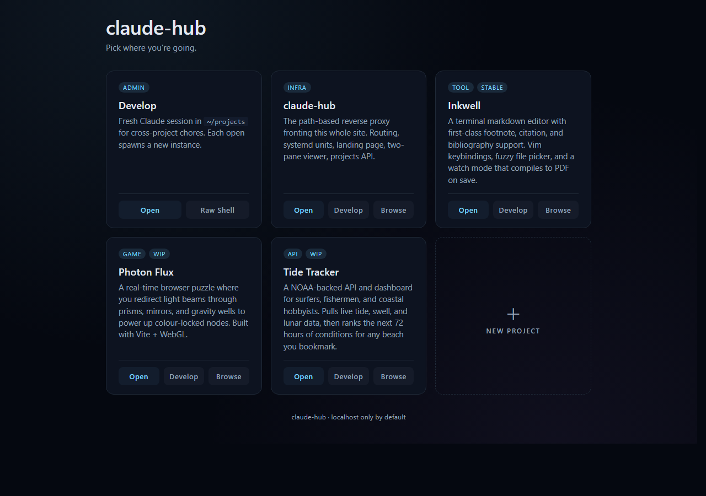
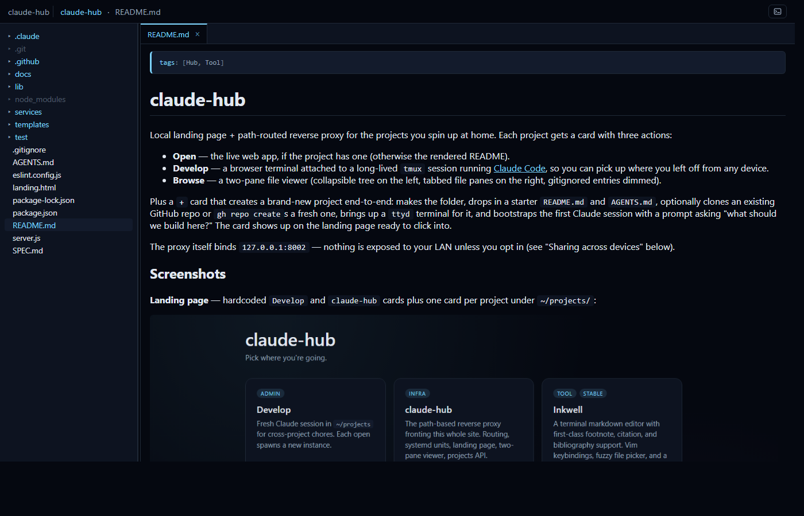
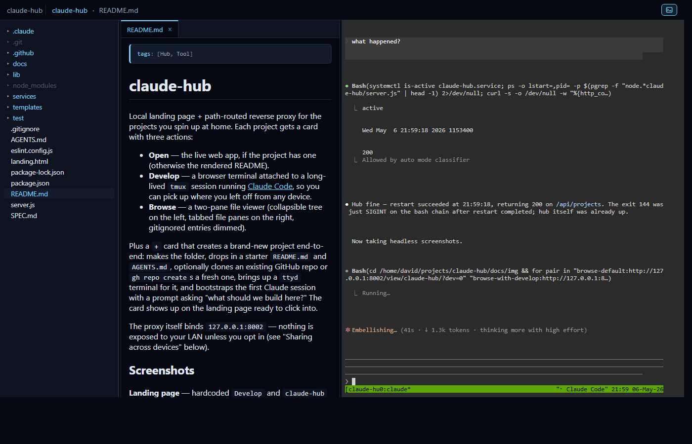
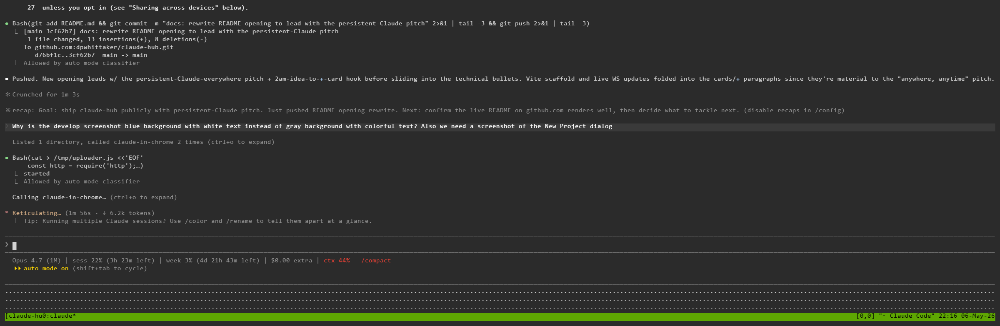

# claude-hub

**Persistent [Claude Code](https://claude.ai/claude-code) sessions in your browser, on every device you own. Start a project on your laptop, pick up the same conversation from your phone on the bus, ship it from a tablet on the couch.** One URL, one tmux per project, every Claude session waiting exactly where you left it.

A new idea hits at 2am? Tap `+`. claude-hub mints a fresh project — folder, README, AGENTS.md, optional GitHub repo, Vite scaffold, dev server — and drops you straight into a Claude session that asks "what should we build here?" Build your next project anytime, anywhere.

Each project gets a card with three actions:

- **Open** — the live web app, if the project has one (otherwise the rendered README).
- **Develop** — a browser terminal attached to a long-lived `tmux` session running Claude Code, so you can pick up where you left off from any device.
- **Browse** — a two-pane file viewer (collapsible tree on the left, tabbed file panes on the right, gitignored entries dimmed, live updates pushed over WebSocket so edits Claude makes show up without a refresh).

Plus a `+` card that creates a brand-new project end-to-end: makes the
folder, drops in a starter `README.md` and `AGENTS.md`, optionally clones an
existing GitHub repo or `gh repo create`s a fresh one, scaffolds a
Vite + React + TypeScript app (with `npm install` and an autostarted dev
server already wired through the proxy), brings up a `ttyd` terminal for
it, and bootstraps the first Claude session with a prompt asking "what
should we build here?" The card shows up on the landing page ready to
click into.

The proxy itself binds `127.0.0.1:8002` — nothing is exposed to your LAN
unless you opt in (see "Sharing across devices" below).

## Screenshots

**Landing page** — every project gets a card with badges, description, and three actions. The `+` tile opens a dialog that bootstraps a brand-new project end-to-end (folder, README, AGENTS.md, optional `gh repo create` / clone, ttyd terminal, fresh Claude Code session asking "what should we build here?"). Claude is the engine behind every card, every Develop button, every scaffolded project:



**Browse** (`/view/<project>/`) — collapsible tree on the left (gitignored entries dimmed and lazy-loaded), tabbed iframes on the right. README opens in the initial tab; markdown renders with YAML frontmatter highlighted, `*.html` files get an eye icon to render the page in-place, and the file watcher pushes live updates so edits Claude makes in your terminal show up here without a manual refresh:



**Browse + Develop side-by-side** — the terminal icon in the header (or `?dev=1` on the URL) opens the `Develop` pane to the right with a draggable splitter. The same long-lived tmux Claude session that you'd reach via the `Develop` button is now beside the file viewer, so you can read, ask, and edit in one window. This is the core workflow: Claude writes, the tree refreshes, your tab reloads, you keep reading:



**Develop** (`/term/<project>/`) — the same browser terminal full-screen. ttyd attaches to a per-project tmux session running `claude --continue`, so you pick up the same conversation from any device. Claude is doing the work; the hub is the interface:



> Refresh these screenshots after a UI change with the `screenshots` skill (in `.claude/skills/screenshots/`).

## Quickstart

```bash
git clone https://github.com/<you>/claude-hub.git ~/projects/claude-hub
cd ~/projects/claude-hub
npm install

# 1. Run it directly to confirm it boots.
node server.js
# → claude-hub listening on http://127.0.0.1:8002
# Visit http://127.0.0.1:8002 in a browser.

# 2. Or install the systemd units so it survives reboots.
# All units in services/ ship with `/home/USER` placeholders — substitute
# your account's home dir at install time. systemd does not expand `%h` in
# system-mode units even with `User=`, so an explicit path is required.
sudo bash -c 'sed "s|/home/USER|$HOME|g; s|^User=david|User='"$USER"'|" services/claude-hub.service > /etc/systemd/system/claude-hub.service'
sudo systemctl daemon-reload
sudo systemctl enable --now claude-hub.service
```

For terminal cards (`/term/<project>/`) you also need `ttyd` installed
(`apt install ttyd` on Debian/Ubuntu) and the templated unit:

```bash
# Substitute /home/USER + User=david placeholders at install time.
for u in ttyd@.service ttyd-develop.service ttyd-wsl.service; do
  sudo bash -c "sed 's|/home/USER|\$HOME|g; s|^User=david|User=\$USER|' services/\$u > /etc/systemd/system/\$u"
done
sudo install -m 755 services/ttyd-attach.sh /usr/local/bin/ttyd-attach.sh
sudo systemctl daemon-reload
sudo systemctl enable --now ttyd-develop.service ttyd-wsl.service
```

When you create a project via the `+` card, `ttyd@<name>.service` is
enabled for it automatically.

For Vite-template projects (the default in the create dialog) you also need
the per-project Vite dev-server unit:

```bash
sudo bash -c 'sed "s|/home/USER|$HOME|g; s|^User=david|User='"$USER"'|" services/vite@.service > /etc/systemd/system/vite@.service'
sudo systemctl daemon-reload
```

`vite@<name>.service` is enabled + started by claude-hub during scaffold.
The unit runs `npm run dev` in the project directory under `Restart=always`,
so the dev server survives crashes and host reboots. claude-hub allocates a
free port ≥ 5173 per project and writes it into `vite.config.ts` and the
project's `.project-meta.json` (`proxyTarget`, `proxyPrefix`,
`stripPrefix: false`, `openUrl: /<name>/`) so the proxy serves the app at
`/<name>/` with no further config.

`sudo` for `systemctl enable --now vite@<name>.service` and the matching
`disable --now` on project delete relies on the same passwordless sudo grant
already used by `ttyd@`. Add to `/etc/sudoers.d/claude-hub`:

```
david ALL=(root) NOPASSWD: /bin/systemctl enable --now vite@*.service, /bin/systemctl disable --now vite@*.service
```

## Sharing across devices (Tailscale)

claude-hub doesn't try to be a publicly reachable server — by default it
listens on loopback only. The simplest tested way to get at it from your
phone or laptop is via [Tailscale](https://tailscale.com):

1. Install Tailscale on the host running claude-hub and on each device you
   want to reach it from.
2. On the host: `tailscale serve --bg --https=443 http://localhost:8002`
3. Open `https://<your-host>.<your-tailnet>.ts.net/` from any tailnet peer.

Tailscale handles HTTPS (with an auto-renewing Let's Encrypt cert) and the
peer-to-peer routing. Nothing is exposed to the public internet. To stop
sharing: `tailscale serve --https=443 off`.

If you ever want it publicly reachable, `tailscale funnel --bg --https=443
http://localhost:8002` is the equivalent — but be deliberate about it,
since the Develop terminals run live Claude Code sessions with full
filesystem access to `~/projects`.

## Project layout

| File | Role |
|---|---|
| `server.js` | The whole proxy: routes, file viewer, projects API. ~2k lines, no framework. |
| `landing.html` | Static landing page. Hardcoded cards for Develop + Proxy; fetches the rest from `/api/projects`. |
| `services/claude-hub.service` | systemd unit for the proxy itself. |
| `services/ttyd@.service` | Templated systemd unit. `systemctl enable --now ttyd@<project>` brings up a per-project terminal. |
| `services/ttyd-develop.service`, `services/ttyd-wsl.service` | Static admin terminal units (fresh claude in `~/projects`, raw bash). |
| `services/ttyd-attach.sh` | Helper that ttyd execs per browser connection — joins or creates the per-project tmux session. |
| `AGENTS.md` | Architecture + ops + gotchas. Read it before changing the routing or the systemd units. |

## See also

- `AGENTS.md` for the full architecture, route table, and the list of
  things that have bitten past sessions.
